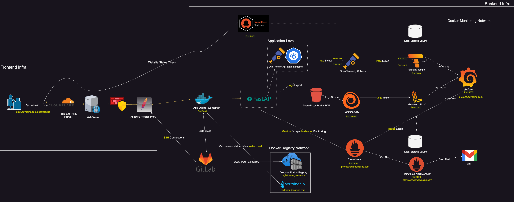
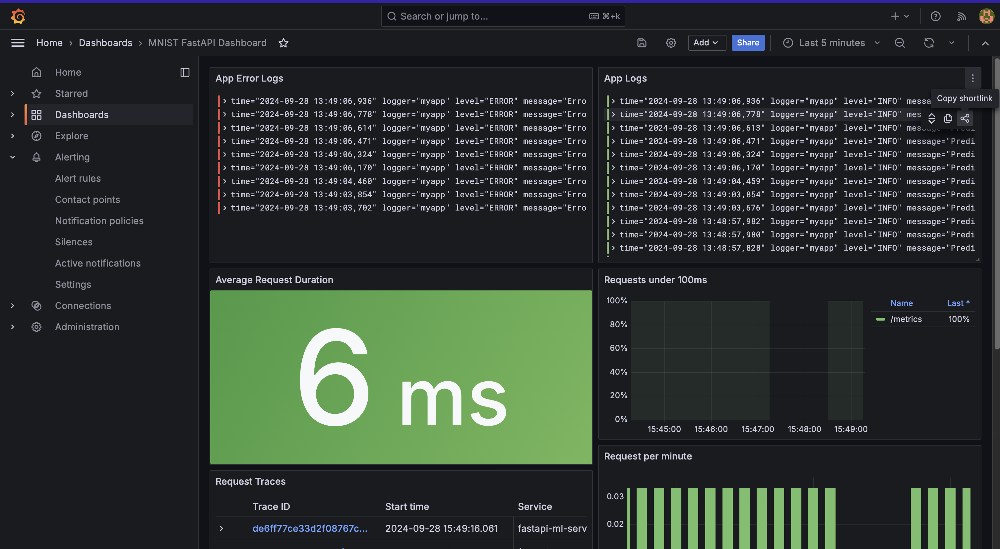
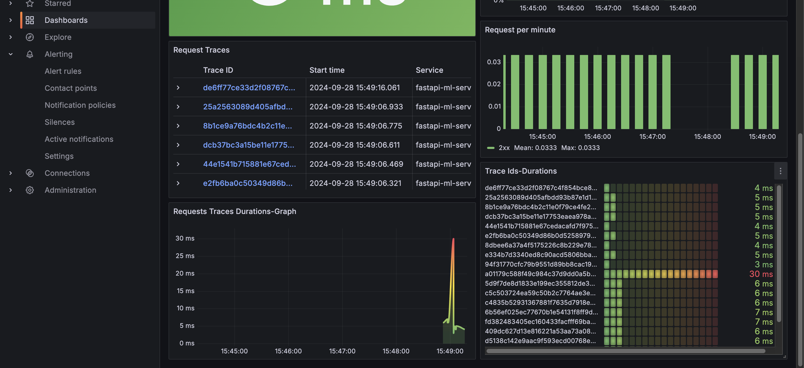

# MNIST API: FastAPI-based MNIST Classifier

This repository contains a FastAPI-based implementation of a MNIST classifier. The CNN imported model from `best_model.pth` file is built with pytorch and trained on a MNIST dataset . The API accepts a POST request with an image and returns the predicted digit.

The project also includes a monitoring stack using **Prometheus**, **Grafana**, **Alertmanager**, and **OpenTelemetry** to provide insights into application performance.

## Features
- **MNIST Classification**: Predicts handwritten digits from the MNIST dataset.
- **FastAPI**: A modern, fast (high-performance) web framework for building APIs.
- **Monitoring Stack**: Integrated metrics, logging, and tracing for system observability.
    - **Prometheus**: Scrapes and collects metrics.
    - **Grafana**: Visualizes metrics, logs, and traces.
    - **Alertmanager**: Manages alerts triggered by Prometheus.
    - **OpenTelemetry Collector**: Collects traces and exports them to **Tempo**.
    - **Alloy**: Collects logs and sends them to **Loki**.
    - **Loki**: Centralized log storage queried through Grafana.
    - **Tempo**: Distributed tracing backend used as a data source in Grafana.
    - **Blackbox Exporter**: Monitors API availability.

## Requirements
- Docker
- Docker Compose

## Production Deployment
The main branch deploys the app's Docker image directly to [Devgains Docker Registry](https://registry.devgains.com) and updates the production URL at [mnist.devgains.com](https://mnist.devgains.com).

## Infrastructure Diagram


## Grafana Dashboards



## Local Deployment Instructions

### 1. Set Up Monitoring Stack
To bring up the entire monitoring stack locally, run:

```bash
mkdir -p logs && mkdir -p tempo-data
docker compose up --build -d
```

### 2. Build and Run the MNIST API

#### Build the Docker image:
```bash
docker build -t mnist-api .
```

#### Run the Docker container:
```bash
docker run -d --name mnist-api --network monitoring --network-alias=mnist-api -v $(pwd)/logs:/app/logs -p 7000:7000 mnist-api
```

### 3. Access the Api Documentation
The API documentation is available at: [http://localhost:7000/docs](http://localhost:7000/docs)
To test the API, click on "Try it out", load an image, and then click "Execute". You can find sample test images in the test_images folder.

### 4. Stop the MNIST API Container
```bash
docker stop mnist-api
```

### 5. Stop the Monitoring Stack
```bash
docker compose down
```

## Monitoring Tools Access (Local Deployment)

- **Prometheus**: [http://localhost:9090](http://localhost:9090)
- **Grafana**: [http://localhost:3000](http://localhost:3000) (Username: admin, Password: Devgains@2016)
- **Alertmanager**: [http://localhost:9093](http://localhost:9093)

## Monitoring Tools Access (Production)

- **Prometheus**: [https://prometheus.devgains.com](https://prometheus.mnist.devgains.com) (Username: admin, Password: Devgains@2016)
- **Grafana**: [https://grafana.devgains.com](https://grafana.devgains.com) (Username: admin, Password: Devgains@2016)
- **Alertmanager**: [https://alertmanager.devgains.com](https://alertmanager.devgains.com) (Username: admin, Password: Devgains@2016)
- **Portainer**: [https://portainer.devgains.com](https://portainer.devgains.com) (Username: admin, Password: Devgains@2016) - For managing Docker containers.

## API Authentication
The API requires a bearer token for authentication. The token is : `ABDELHAMEMELOPSE`

## Liscence

MIT  License

Copyright (c) [2025] [Devgains]

Permission is hereby granted, free of charge, to any person obtaining a copy of this software and associated documentation files (the "Software"), to deal in the Software without restriction, including without limitation the rights to use, copy, modify, merge, publish, distribute, sublicense, and/or sell copies of the Software, and to permit persons to whom the Software is furnished to do so, subject to the following conditions:

The above copyright notice and this permission notice shall be included in all copies or substantial portions of the Software.
THE SOFTWARE IS PROVIDED "AS IS", WITHOUT WARRANTY OF ANY KIND, EXPRESS OR IMPLIED, INCLUDING BUT NOT LIMITED TO THE WARRANTIES OF MERCHANTABILITY, FITNESS FOR A PARTICULAR PURPOSE AND NONINFRINGEMENT. IN NO EVENT SHALL THE AUTHORS OR COPYRIGHT HOLDERS BE LIABLE FOR ANY CLAIM, DAMAGES OR OTHER LIABILITY, WHETHER IN AN ACTION OF CONTRACT, TORT OR OTHERWISE, ARISING FROM, OUT OF OR IN CONNECTION WITH THE SOFTWARE OR THE USE OR OTHER DEALINGS IN THE SOFTWARE.

## Author
```bash
Ahmad Harkous
Thomas Fermeli Furic 
Abdelhamid Mouti
```


